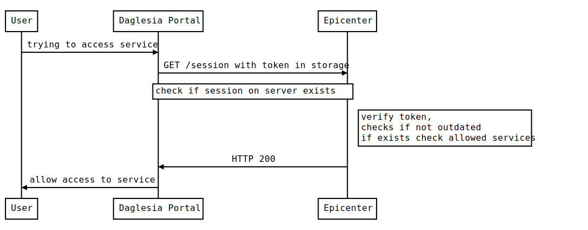
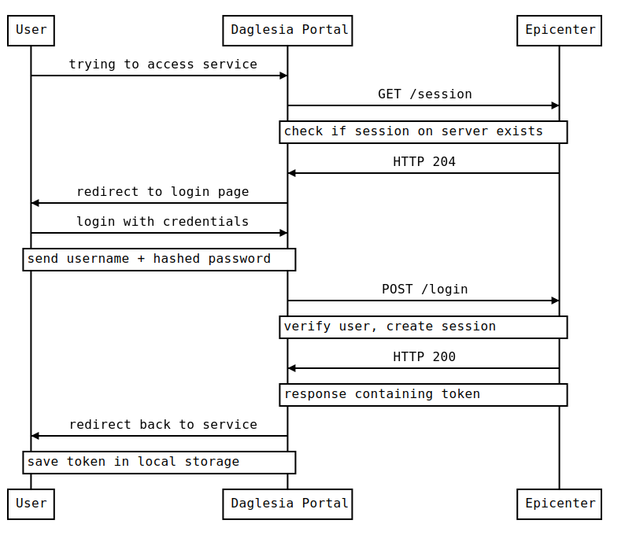

# Title
Login flow in the application
## Status
Diagrams written and documented. Will use OAuth2 - implementation details in diagrams below.
## Context

All Daglesia-related solutions (described as Daglesia Portal) need some form of authorization and authentication.

This document describes the flow of authorization (login flow).

## Decision

User access in Daglesia Portal will all be handled by Auth9 with OAuth2. By doing it this way Daglesia Portal doesn't need to have the separate login page and credentials for each solution. When user is trying to access the service, a call to Epicenter will be done to check the validity of the session and the token (if provided). See diagram below:

In case of no session, it has to be made from scratch, but only if provided with valid user credentials. This will also return a token to be saved in storage. See diagram below:

## Consequences

This approach, even if complicated, is an industry-standard approach to authorization. By using sessions user won't have to login every time that service would be used. By using tokens, the username + password will be sent as little as possible, to improve data security. It would also mean easier implementation of authentication, as the token returned can also contain possible roles of that particular user.